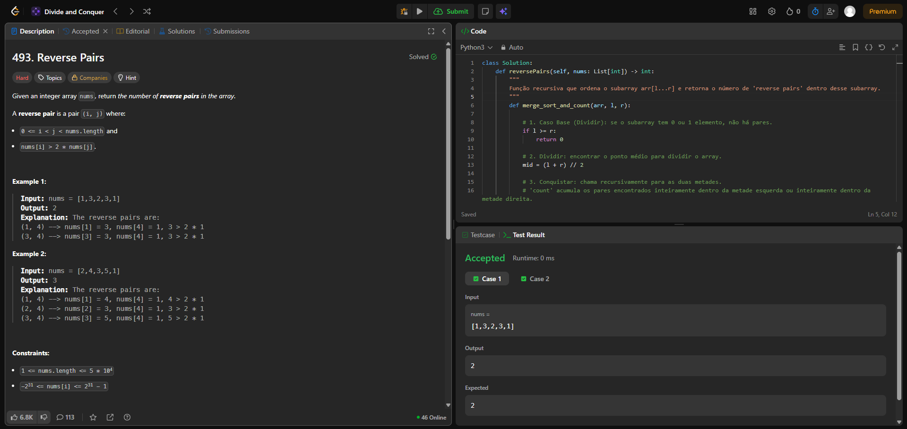
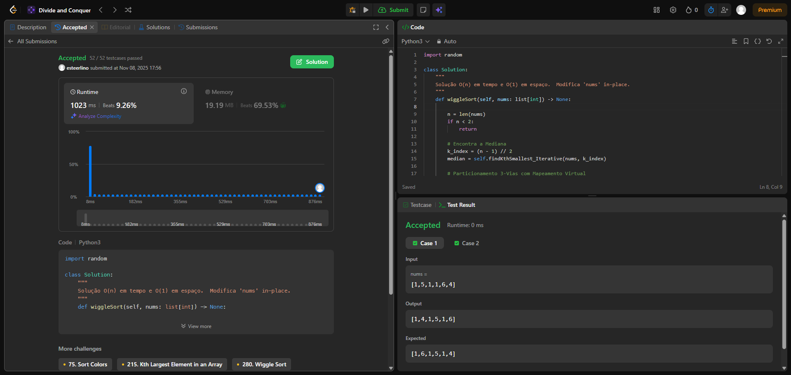

# Trabalho 4 - Dividir e Conquistar

**Número do trabalho:** 4  
**Conteúdo da Dsiciplina:  Dividir e Conquistar**

## Alunos

| Matrícula |        Nome Completo       |
|:---------:|:-------------:|
| 20/2063201 | Ester Flores Lino da Silva |
| 20/2042927 | Eduardo Schuindt Santos    |

## Definição do Trabalho

Para o Trabalho 4 a dupla optou por solucionar questões da plataforma **[LeetCode](https://leetcode.com/)**. Seguindo as orientações do professor Maurício Serrano, resolvemos 4 desafios. Dois do nível difícil e dois do nível médio. Dessa maneira, a dupla busca demonstrar o conhecimento adquirido durante as aulas e estudos sobre o tema Dividir e Conquistar.

Sobre a realização do trabalho, cada exercício contém seu código resposta, screenshots da tela de submissão do **[LeetCode](https://leetcode.com/)** e vídeo de até 5 minutos explicando objetivamente as resoluções propostas.

## Linguagem utilizada

A linguagem de programação utilizada para resolver cada exercício foi o Python.

## Screenshots

### Exercício 01 - Difícil - 493. Reverse Pairs

### Exercício 02 - Difícil - 

### Exercício 03 - Médio - 324. Wiggle Sort II

### Exercício 04 - Médio -

## Vídeo de apresentação do Trabalho 4

[Link da apresentação do Trabalho 4]()

## Verificação

Para verificar se as resoluções aqui propostas estão corretas e foram aceitas, submeter os códigos no **[LeetCode](https://leetcode.com/)** e conferir se foi aceito ou não. Todo exercício contém o link para descrição do problema no seu próprio código de resolução.
